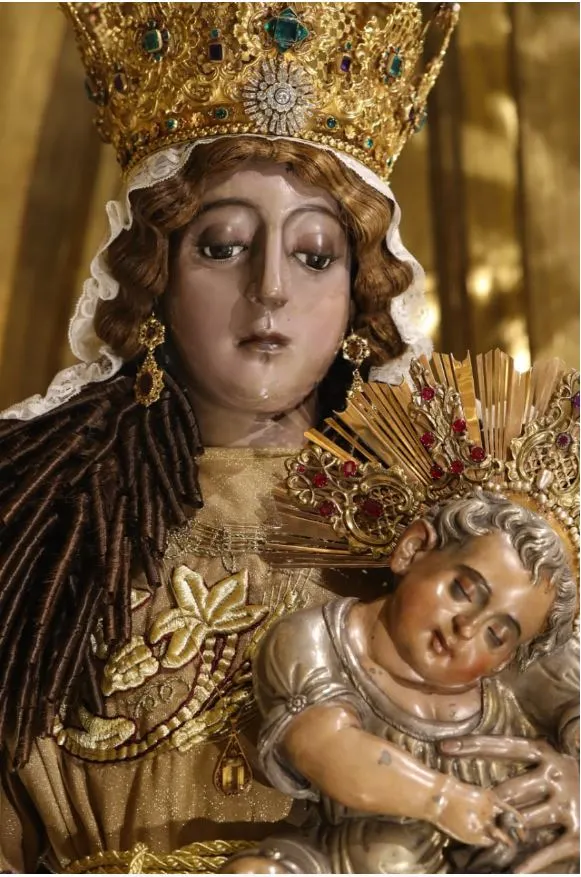

<!DOCTYPE html>
<html lang="es">
<head>
    <meta charset="UTF-8">
    <meta name="viewport" content="width=device-width, initial-scale=1.0">
    <title>Virgen del Rosario de Santo Domingo</title>

    
</head>

<body>

    <header>
        <h1>Virgen del Rosario de Santo Domingo</h1>
    </header>

    <section>
        <h2>Patrona de Fe y Devoción</h2>

         

        

        <p1>
            El dominico padre López de Montoya, fue uno de los primeros predicadores dominicos por estas tierras. Era un hombre de mucha devoción y fue un gran devoto del rosario. Por su gran entusiasmo por el rosario y con la generosidad del pueblo guatemalteco, para ayudar a toda obra de culto divino, decide mandar hacer una imagen de la Virgen, con su vestido y peana todo de plata; para colocarla en su capilla. Existen dos versiones acerca de quienes elaboraron la imagen de plata de la Virgen del Rosario. Uno de ellos es el de la Dra. Josefina Alonzo de Rodríguez; ella afirma lo siguiente:” Revolledo, Andrés. Maestro Platero. Natural de Sevilla. Vecino de Santiago de Guatemala. Es mencionado por Miguel Fernández Concha, afirmando que fue maestro de los plateros Nicolás Almaina, Lorenzo de Medina y Pedro de Bozarraéz, los tres correspondientes al ultimo cuarto del siglo XVI, lo que sitúa a Revolledo como uno de los primeros plateros de Santiago”. Podemos entonces decir que los plateros antes mencionados fueron los artífices de dicha imagen. Dice la Doctora Josefina Alonzo de Rodríguez que: “ fue discípulo del platero sevillano residente en Santiago, Andrés Revolledo y fue uno de los tres plateros que tuvieron a su cargo fundir en plata la imagen de Nuestra Señora del Rosario de Santo Domingo hacia 1580”.  De esta manera sabemos además del nombre de los plateros que la hicieron, también la fecha. En cuanto a la otra versión; ésta se refiere a la del licenciado Juan José Falla: “ En la ciudad de Santiago de Guatemala, a diez de junio de 1581, ante Luis Aceituno de Guzmán, Escribano, Público, Antonio de Rodas y Tomás de Villasanta, plateros, vecinos de esta ciudad, declararon haber recibido de Diego de Paz Quiñonez vecino de esta ciudad, como Mayordomo de Nuestra Señora del Rosario, en diferentes pagos, un total de mil doscientos setenta y ocho pesos con siete tomines de oro, para la plata y la hechura de la imagen de plata de Nuestra Señora del Rosario, que ellos tenían a su cargo hacer.” Con esta información de gran valor a dicha investigación se le conoce además la fecha en que fue encargada, por quién y cuánto fue el precio que se pagó por la elaboración de la Virgen del Rosario. Con estas informaciones entendemos entonces que se tienen dos versiones, de las cuales no es el propósito de ésta investigación cual de ellas es la que más se acerca a la realidad, únicamente nos limitamos a hacer mención de ambas porque creemos que es conveniente referirnos a las dos. La imagen de la Virgen del Rosario, hecha toda de plata; destinada para el templo de Sto. Domingo, de la Antigua Guatemala, mide dos varas de alto. La imagen modelo fue la Virgen del Rosario llamada Nuestra Señora de La Antigua, después la llamaron La Dómina; el padre Remasal indica al respecto: “la imagen tuvo la cofradía de los españoles, era de mucha devoción, como se conoce hoy con el título de Nuestra Señora La Antigua,  era la mejor que existía en su tiempo en Indias. Fuentes y Guzmán menciona: “el molde en que se vació esta talla, peregrina imagen de la Virgen Nuestra Señora, está con mucha veneración en su altar muy decente, en un pasadizo que entra al noviciado, y la llaman a la imagen La Dómina, porque allí todos los días del año se juntan la comunidad y es muy digno reparar en que siendo aquel verdaderamente, el molde en que se hizo la fundición, no hay semejanza poca, si mucha, en ellas, siendo así esta imagen la Dómina es bellísima, lo que la Virgen de plata mucho más con superiores grados”, Se puede confirmar entonces que la Virgen del Rosario de la iglesia de Santo Domingo fue fundida utilizando como molde donde fue vaciada, la llamada Dómina, ( esta escultura guatemalteca fue elaborada en la segunda mitad del siglo XVI ( 1520- 1600). Por lo tanto presenta rasgos manieristas. Una de las características principales de una obra manierista es su insistencia en la primacía de la figura humana, que en todos los casos, se presenta en actitud forzada, en esta imagen el niño Dios presenta grande distorsiones. Como es el caso de la Virgen del Rosario y otras obras de esa época. La imagen que sirvió de molde para reproducir esta escultura de plata, (la Dómina) se destruyó en los terremotos de Santa Marta el 29 de julio de 1773. Esta imagen fue tallada en Guatemala por un escultor anónimo, fue quien trabajó también, la imagen de la Virgen de Chiantla, también revestida de plata, en el pueblo de Chiantla, pequeña ciudad cercana a Huehuetenango. Esto lo indica el padre Remesal: “Al pueblo de Chiantla, de la orden del Convento de Santo Domingo de Guatemala, a la devotísima imagen de Nuestra Señora que se encuentra allí fue realizada por el mismo oficial llamándola Nuestra Señora del Rosario, La Antigua, imagen a diferencia de la nueva que se hizo en plata de la misma advocación” </p1>

 <h2>Sus Traslados:</h2><p2>

Los traslados que ha tenido la imagen de la Virgen del Rosario, desde su elaboración hasta la fecha, han sido pocos. “Al poco tiempo a hacer la imagen, los dominicos reedificaron la capilla, y la enriquecieron con un buen retablo y hermosísimo camarín donde colocaron a la Virgen”. Es aquí donde ocupa el primer sitio destinado especialmente para Ella; una capilla adecuada, pero después deciden los dominicos construir una nueva capilla mucho mejor y más grande que la anterior. “En 1667 le levantaron otra nueva, que no era tan grande como se deseaba, por no haberse podido entonces conseguir más terreno, pero en ella hizo el constructor, primores de arte. Se estrenó el año siguiente”. Años más tarde se le edifica una capilla mucho más grande y suntuosa pues se pudo conseguir más terreno por el interés de los hermanos D. José Eguizabal y D. José Samayoa, ambos vizcainos, pudo edificarse una gran capilla a la Virgen del Rosario siendo talvez la mejor que hubo en la Antigua Guatemala, al respecto dice: “Fuentes y Guzmán que era elegante y maravillosa, el p. Ximénez le llama suntuosa, magnifica  digno relicario de la santa imagen,  el padre cadena la considera como abreviado alcázar de la gloria”. Esta capilla se arruinó en el año de 1773, con los terremotos de Santa Marta. A raíz de esta catástrofe, se decide trasladar la ciudad, a otro lugar más seguro, y el 1o de Enero de 1776 se traslada o se funda la Nueva Guatemala, Valle de la Ermita. Instalándose en ella el Ayuntamiento el 20 de febrero de ese mismo año, el Superior Gobierno dio posesión a los dominicos, del sitio para construir iglesia y convento edificada “ en la parte oriental de la ciudad  terreno que media 300 varas de norte a sur y 400 de oriente a occidente”  la piedra que utilizaban la sacaron de unos cerros de la aldea Las Vacas, es la primera comunidad que edifica en la Nueva Ciudad. Para mediados del año de 1778, se tenía ya por parte de los dominicos levantada una gran iglesia provisional y gran parte del convento. Fue bendecida la iglesia en 1808, en la actualidad ostenta el título de Basílica Menor de Nuestra Señora del Rosario. No se tiene la fecha exacta de cuando trasladan la imagen de plata de la Virgen del Rosario a la Nueva Ciudad; imagen que por 200 años más o menos fue objeto de veneración y devoción por los habitantes de la Antigua Guatemala. Existe un dato importante; aunque no se conoce la razón, de que la Virgen del Rosario fue colocada por espacio de algún tiempo en la casa del Ministro de la Real Hacienda, D. Francisco de Náxera, localizada en la 6a avenida sur No 6; mientras se construía la nueva iglesia . “El 5 de noviembre de 1808, todas las campanas de la ciudad se echaron a vuelo. A las cuatro de la tarde, salió de Santo Domingo, una procesión que se dirigió a la casa del Ministro de la Real Hacienda, para recoger a la Virgen del Rosario, que estaba allí depositada, y traerla al nuevo templo dominico, que se iba a estrenar al día siguiente”. La devoción del rosario en todas sus advocaciones data de 1888, establecida por Fray Julián Riveiro y Jacinto”. Para el terremoto de 1976, La Basílica de Nuestra Señora del Rosario, sufrió severos daños, y por tres años fueron trasladadas las principales imágenes a una Capilla provisional, situada, a un costado del templo; sobre la 10a. calle; regresando de nuevo al templo el domingo 30 de septiembre de 1979. Desde esta fecha ya no ha tenido ningún traslado, la imagen de la Virgen del Rosario, permanece en la Basílica de la iglesia de Santo Domingo en la ciudad de Guatemala.</p2>

<h3>Cambios Estructurales de la Imagen.</h3><p3>

La imagen de la Virgen del Rosario de la iglesia de Santo Domingo, tiene dos varas de alto. Ha sufrido escasamente uno o dos cambios estructurales, de los cuales el más importante fue cuando se restauró casi en su totalidad, a consecuencia de los terremotos ocurridos en el año de 1773. Donde quedó bajo los escombros. Ya que la iglesia de Santo Domingo situada en ese entonces en la Antigua Guatemala; se destruyó. Y la imagen quedó en varias partes, deformada y dividida en piezas de diferente tamaño. Como lo indica la Doctora Josefina Alonzo de Rodríguez: “Con el terremoto mencionado, la imagen elaborada en plata de la Virgen del Rosario quedó completamente desfigurada y recoge la afirmación del padre Cadena, sobre que la imagen fue sepultada por el polvo, deformada y dividida en varias piezas, bien que extraídas después, ordenada y compuestas a solicitud de los dominicos y esmero de artífices y peritos, restauró toda belleza y perfecciones que había perdido, duplicando su hermosura, para copiar más vivamente a su original sagrado”. Según: La Doctora Josefina Alonzo de Rodríguez “los daños y modificaciones sufridas por la imagen tratada no fueron muchos pues se encontró una pintura anterior a 1773, que corresponde a la Virgen del Rosario de la iglesia de Santo Domingo; la cual representa su estado original dicha pintura  se encuentra en la puerta de un sagrario en la Basílica de Esquipulas”. “El platero que tuvo a su cargo la restauración de la Virgen del Rosario fue Joseph Cornelio de Lara en 1774. En esta intervención no hubo proceso de fundición,  por lo menos esta vez no se fundió parte de la imagen de la Virgen”. Esta restauración es la más significativa, aunque después ha tenido otros retoques en sus vestiduras, la figura no ha sufrido cambios </p3>
estructurales.

 

 
<h4>Estado Actual.</h4><p4>

 Después de la restauración que tuvo la imagen en 1774, ya no ha sufrido cambio alguno; por lo que se deduce que desde esa fecha a la actualidad a permanecido intacta. Hoy en día es una imagen de plata, con vestido y de tamaño natural. La técnica fue realizada en molde vacío. La idea barroca era que nada debe ser estático, un poco de movimiento en la escultura; por esto es que el niño tiene más características manieristas que la Virgen, aunque ella pertenece a este estilo. Se encuentra en buenas condiciones. Está colocada en el camerino central del altar mayor. La imagen de la Virgen es hueca, formada por planchas de plata, asegurada por tornillos. La cabeza esta cubierta de cabellos repujados en plata, pero sobre estos lleva una cabellera de cabello natural; sostenida también por tornillos. El conjunto está compuesto de diversas láminas de plata. El brazo derecho se completa con la mano, lo que no sucede con el brazo izquierdo; que no se ve, ya que en el está colocado el niño. El rostro de la Virgen de madera policromado, las facciones están delicadamente trabajadas, los ojos de vidrio, grandes están semicerrados y se dirigen hacia el niño a quien lleva cargado; la nariz es recta y la boca pequeña, la cabeza es muy grande en relación al cuerpo. En sus hombros tiene decoración dando forma a las mangas de el vestido, en sus brazos hay una serie de pliegues y adornos que enriquecen el vestido hecho también de plata y que forma parte del conjunto o estructura de la imagen. Dando estos pliegues un mayor sentido barroco a la escultura. Está vestida con túnica y capa que se sostienen por medio de tornillos incrustados al cuerpo de la imagen. La figura del niño también es de plata, y tiene una actitud de reposo pero con un giro manierista el niño está dotado de movimiento. Es una imagen excelentemente trabajada, de facciones finas, lienzos suaves, aunque anatómicamente no es perfecta, puesto que está realizada con elementos manieristas. La parte posterior es plana, para que se acople al cuerpo de la Virgen está figura está también sostenida por tornillos. En la actualidad la imagen de la Virgen del Rosario, para darle un sentido barroco se le agrego ricos ropajes; además de la corona, pendientes, y el rosario que lleva en sus manos, y la vara edilicia que sostiene en su mano derecha, ( Mediante acuerdo de la Corporación Municipal Metropolitana de fecha 16 de Julio de 1992, indica en uno de sus considerandos lo siguiente: Declarar Alcaldesa de Guatemala a la Santísima Virgen del Rosario, que se venera en la Basílica que lleva su nombre”.  el domingo 4 de octubre de 1992 el alcalde de la ciudad de Guatemala Licenciado Oscar Berger Perdomo, acompañado de su esposa y miembros de la Corporación Municipal, El Alcalde colocó a la Virgen del Rosario, cuatricentenaria obra de arte y de fe, la Vara Edilicia que se sumó al cetro de Reina, convirtiéndola en Alcaldesa y Reina de Guatemala.”). la hacen representativa como reina del cielo y de la tierra, complementando el cuadro la luna bajo sus pies símbolo de pureza celestial. La figura del niño como de un mes de nacido tiene un gran movimiento un tanto forzado y. La Virgen en cambio, en su rostro se refleja ternura y juventud. El escultor logró imprimirle a las facciones de esta imagen, dulzura y ternura. </p4>

 

 
<h5>Religiosidad:<h5> <p5>

Algunos aspectos de la representación de la Virgen, como la Virgen del Rosario, están dirigidos a inculcar las devociones concretas. No debiendo olvidar la Contrareforma, que inculcó un clima de devoción concreta, es así como surgen diferentes advocaciones marianas. Que todos aquellos que creen y tienen fe en ella saben que dará las indulgencias ofrecidas por ella, a todos los que rezan el rosario siempre, y además las oraciones constantes, las visitas a la iglesia, hacen que los cristianos católicos tengan una gran fe en ella. Y algunas de las formas de manifestación de la gran cantidad de los fieles devotos con que ella cuenta, su devoción, su fe, su religiosidad; es en Guatemala (primera nación que celebró la fiesta de la coronación de la Virgen como Reina de todo el Universo) el día 28 de Enero de 1934 es coronada por el Excelentísimo Arzobispo de Guatemala Monseñor Luis Durou y Sure, ésta actividad fue emitida por el decreto papal de Pío XI el 16 de Octubre de 1931. Hubo algunos hechos importantes que se llevaron a cabo con anterioridad a la Coronación de la Virgen del Rosario como Reina de todo el Universo: Con los terremotos de 1651 del 18 de Febrero, al rededor del medio día, sucedió un terremoto, parecía que se hundiera la ciudad y que se acababa el mundo”.  La Virgen fue detenida por el Fraile Esteban Lois y no sufrió ningún daño. Con motivo de estos terremotos se inició el rezo del rosario todos los días en la iglesia de Santo Domingo, costumbre que aún perdura. A raíz de los terremotos de 1651 el Ayuntamiento de Guatemala, decide a la Virgen del Rosario, nombrarla como Patrona de la Ciudad contra los terremotos: “ Juran por Patrona de esta ciudad por los temblores a Nuestra Señora del Rosario. Son encargados de esta fiesta el Capitán Juan López y José Zavaleta”. La fama que tenía y que sigue teniendo el Rosario en Guatemala, su fe y entusiasmo por él; traspasaron las fronteras del país y llegaron hasta Roma, en donde el Papa Clemente VIII , como señal de aprobar todo lo hecho por el Rosario “ decide el 12 de Agosto de 1595, el cuarto año de su pontificado, agregar la Capilla de la Virgen del Rosario de Santo Domingo de la Antigua, la basílica de San Juan de Letrán en Roma, comunicándole todas las gracias e indulgencias de que goza la Madre de todas las iglesias del orbe”. Aumentando más con esta gracia, la devoción de la Virgen del Rosario. Entre los años de 1574-1598 el Rosario prevaleció en Guatemala; estando en el episcopado el Ilustrísimo Fraile, Gómez Fernández de Córdoba, muy devoto del Rosario. Crea una festividad conmemorando el Quinto Misterio Glorioso. Instituyéndola el mismo Fraile Gómez Fernández de Córdoba con Aprobación de su cabildo, de esta manera se adelantó tres siglos a la petición que hizo el Congreso Mariano de Friburgo al Papa, que instituyese una fiesta y proclamase a la Virgen, Reina del Universo fue fijada por el Obispo para el 18 de Agosto”.
        </p5>

         
 
            <video src="fosa.mp4" autoplay loop controls> </video>

         

    </section>

    <footer>
        
© COFRADIA DEL SANTO ROSARIO SANTO DOMINGO

        
© AUTOR AUGUSTO LOBOS

    </footer>

</body>
</html>
